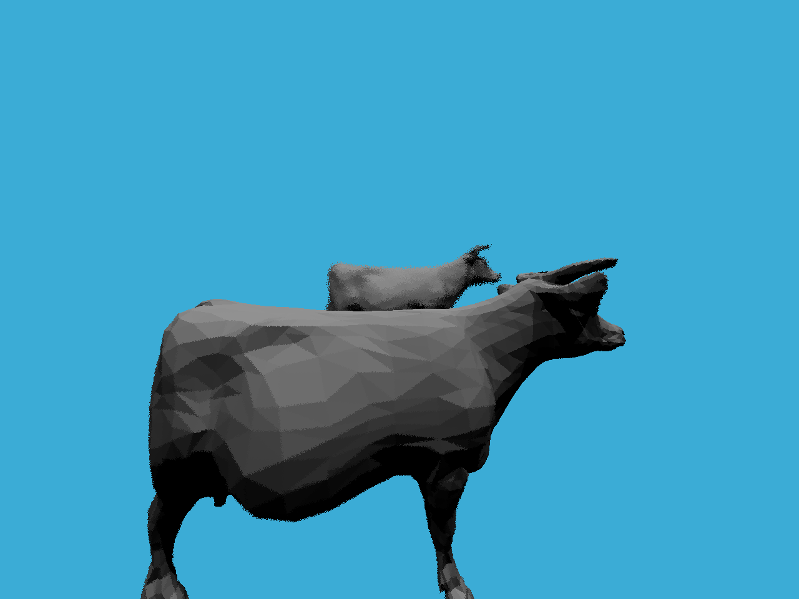

# Light Field Camera 

This is an implementation of a light field camera on 3D models. This gives the scene an apparent depth of field in which some objects are clear and in focus and some are blurred and out of focus. This gives the foreground and background effect seen in most real cameras such as DSLR cameras. This implementation is using a thin lens with neglegible thickness. This project uses Raytracing and bounding volume hierarchy to render the image  

Here is an example of how the lens aperture change affects the objects in focus.




To use this light field camera on our models, navigate to the project folder in terminal and use: 
```bash
mkdir build
cd build
cmake ..
make
./Raytracing 

```
If you wish to add more 3D models, add them to the models folder and in call MeshTriangle on your object, using the x,y and z coordinates to position the camera.  Then add it to the scene with scene.add(yourObject)
```C
MeshTriangle yourObject("yourImagePath", x, y, z, scale, MaterialType::DIFFUSE_AND_GLOSSY);
scene.Add(&yourObject);
```


This project was made with Maxton Ginier and Yinon Rousso as our project showcase for CS-180 Computer Graphics at UCSB 
